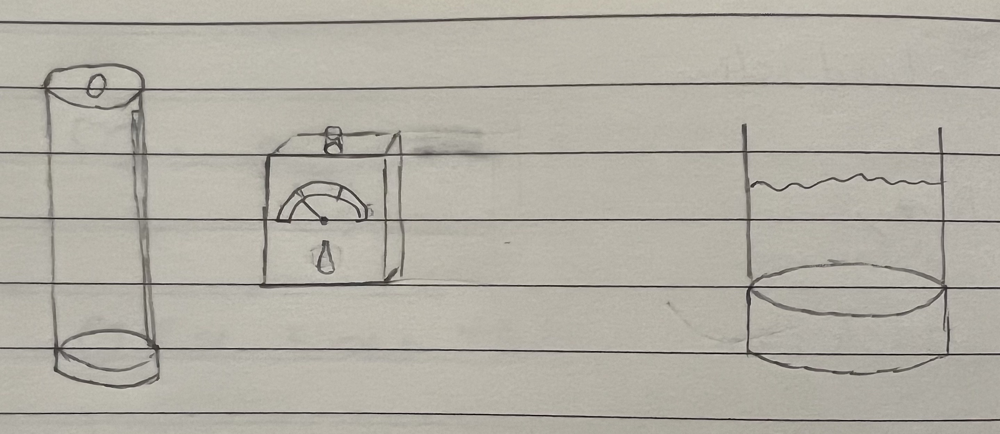
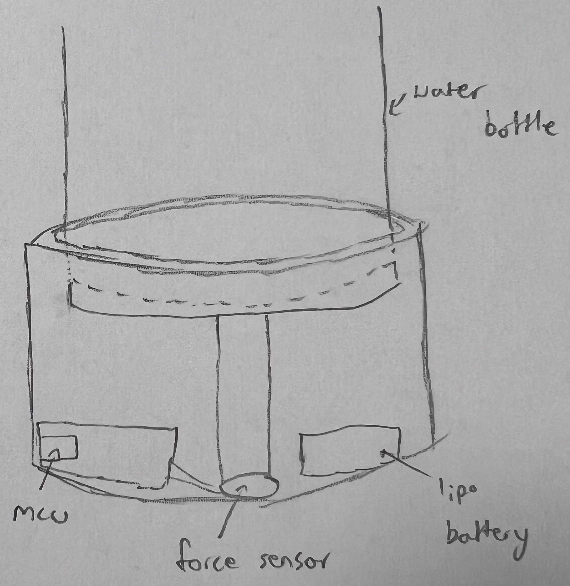
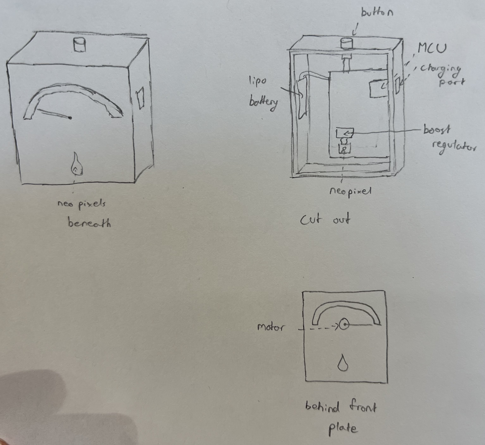
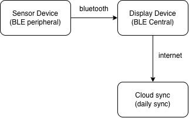
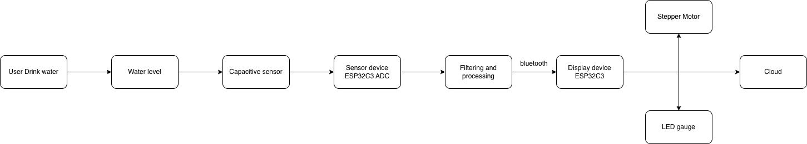

# Hydration Tracker (Sensor + Display)

The goal of this product is to track how much water a user drink in a day. The sensor device would be a smaller puck that can be attached to the bottom of a water bottle to measure the weight of the content of the bottle. The display device would be a box where the gauge will measure if the user reach daily hydration goal. 

**Overall form factor (concept sketch):**
- **Sensor device:** coaster-sized puck attached under bottle (weight sensing + BLE)
- **Display device:** small desktop box with a water-drop window and NeoPixel gradient + top button

  
*The look and form factor of the product*

## Slide 2 — Sensor device (weight + BLE)

  
*The look and form factor of the Sensor device*

### How it works
- The sensor device measures bottle weight using a **force sensor**. 
- The **ESP32-C3** reads the digitized force, filters noise, computes weight delta (consumed water), and save the data.
- It then sends updates to the display using **Bluetooth Low Energy (BLE)** when it's connected.

### Key parts (with part numbers)
- **Force sensor**: [UNEO GHF-10 flat membrane resistive force sensor](datasheets/GHF10-500N_ENG.pdf)
- **MCU**: [ESP32C3](datasheets/esp32-c3_datasheet_en.pdf)
- **Battery**: [Lipo Battery](datasheets/C101-_Li-Polymer_503562_1200mAh_3.7V_with_PCM_APPROVED_8.18.pdf)
---

## Slide 3 — Display device (NeoPixel gauge + Wi-Fi + button)

  
*The look and form factor of the display device*

### How it works
- The display device runs an **ESP32C3** that:
  1. Connects to the sensor over **BLE** to receive weight/consumption updates
  2. Move the **motor** to reflect current consumption toward daily goal
  3. Updates the **NeoPixel** gauge behind a water-drop window (green→yellow→red)
  4. Syncs daily usage to the cloud over **Wi-Fi** 
  5. Holding the **top button** will tare/calibrate the sensor for an empty bottle

### Key parts (with part numbers)
- **MCU**: [ESP32C3](datasheets/esp32-c3_datasheet_en.pdf)
- **LED gauge**: [XL-5050RGBC-WS2812B](datasheets/WS2812B.pdf)
- **Battery**: [Lipo Battery](datasheets/C101-_Li-Polymer_503562_1200mAh_3.7V_with_PCM_APPROVED_8.18.pdf)
- **Boost regulator**: [TPS61023](datasheets/tps61023.pdf)
- **Button**: [PTS636](datasheets/pts636.pdf)
- **Motor**: [28BYJ-48 – 5V Stepper Motor](datasheets/step-motor-5v-28byj48-datasheet.pdf)
---

## Slide 4 — Communication + system flow (2 figures)

### Figure A: Device communication (block diagram)

  
*Diagram displaying how the device communicates*

### Figure B: Detailed data flow (how the system works)

  
*Diagram displaying how the data flows in the system*

---

## Repo structure
- `README.md`
- `images/`
- `datasheets/`
  - (PDFs for each part)
